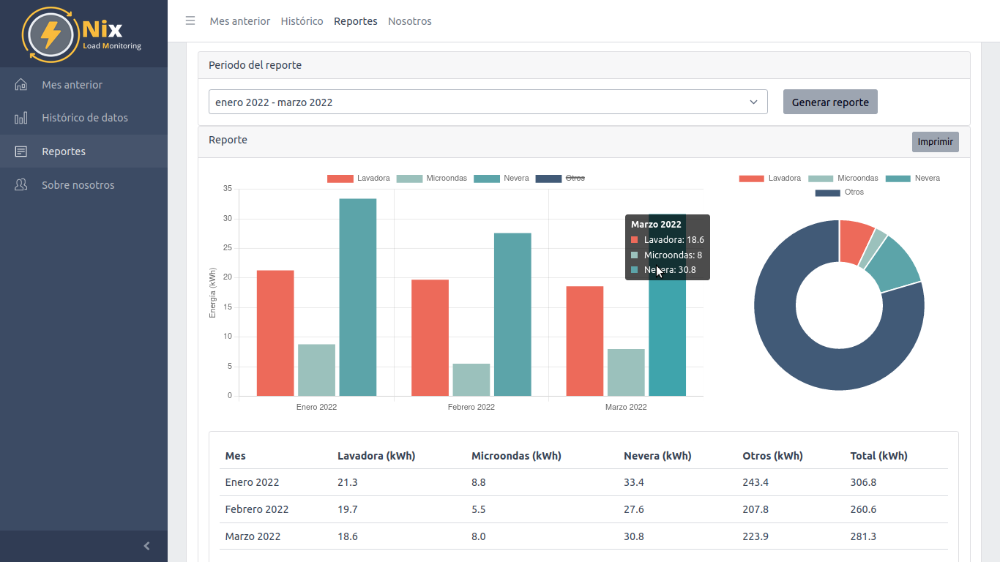

# Dashboard__NILM

This project is called Nix, a dashboard oriented to NILM (Non-Intrusive Load Monitoring). On this dashboard, the user can monitor the energy consumption of three devices: the washing machine, microwave, and fridge. The user can select different dates and obtain the consumption in a month or per hour for each device.

This project is divided in three parts. Firstly, a stage to desegregate the total power consumption through a LSTM neural network, saving the results in MongoDB Atlas. Secondly, an API that makes the queries to MongoDB Atlas, and finally, a web application to show the user different graphs about their electricity consumption. 

For the desegregation process, we implement an LSTM using Keras. The API was developed with Flask. For the frontend, we used React, specifically a Template created by CoreUI. The template can be found here: [CoreUI Pro React Admin Template](https://coreui.io/pro/react). 




## Installation 

``` bash
.
├── API
│   └── src
│       ├── app.py
│       └── requirements.txt
├── Frontend
│    ├── src/             # Frontend root
│    │   ├── assets/      # images, icons, etc.
│    │   ├── components/  # common components - header, footer, sidebar, etc.
│    │   ├── layouts/     # layout containers
│    │   ├── scss/        # scss styles
│    │   ├── views/       # application views (Months.js: consumption per month and per hour, Reports.js, Elect.js: consumption last month, Statis.js)
│    │   ├── _nav.js      # sidebar navigation config
│    │   ├── App.js
│    │   ├── ...
│    │   ├── index.js
│    │   ├── routes.js    # routes config
│    │   └── store.js     # template state example 
│    │
│    └── package.json
│
├── Model_LSTM
│   ├── BBackend_Final.ipynb
│   └── Nix_Core.ipynb

```


### Model_LSTM

This directory is made up of two jupyter notebooks. On the one hand, Nix_Core has the main function that allows connection to MongoDB Atlas. For this, it is necessary to provide the location of the trained models and the data to be analyzed, the latter is also built in this notebook ([Preproccesed Data]([https://coreui.io/pro/react](https://drive.google.com/drive/folders/1d7CwdO99v2v_0pWSBRJlDpGFPcLnFrW4?usp=sharing))). The addresses can be changed by the end user and to carry out a test it is only necessary to define a start date, like this:

Bbackend_to_MongoDB('2022-01-01')

On the other hand, BBackend_Final shows how a model is obtained, in this case, for the fridge. A similar approach can be used for the microwave and the washing machine.

### API 
This directory contains the API developed on Flask. 

1. Create a virtual environment in the API/src folder, where the requirement.txt is
2. Activate the virtual environment
3. Install the used packages: pip install -r requirements.txt
4. Create an .env with Mongo credentials.
     PASSWORD = password
     USERK = user
5. Run the app with python app.py
6. Dev server at http://localhost:5000 


### Frontend
This directory contains the web application's source code. 

1. Install the packages with npm install
2. Run npm start
3. Dev server with hot reload at http://localhost:3000


## License

MIT
